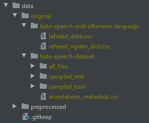

# HateSpeechDetection

## Introduction

This project is part of the text analytics course at Heidelberg university. The goal of this project is to classify 
social media posts on hate speech using text analytics methods. 

This Repo contains all files of the project. 
- The documentation is located in the [docs folder](https://github.com/fidsusj/HateSpeechDetection/blob/main/docs). Within 
this folder you can find among other documents the [project proposal](https://github.com/fidsusj/HateSpeechDetection/blob/main/docs/proposal/project-proposal.pdf) 
and the [project report](https://github.com/fidsusj/HateSpeechDetection/blob/main/docs/report/report.pdf). 
- The project's source code is located in the [src folder](https://github.com/fidsusj/HateSpeechDetection/blob/main/src), 
the tests in the [tests folder](https://github.com/fidsusj/HateSpeechDetection/blob/main/tests) and the code coverage in 
the [htmlcov folder](https://github.com/fidsusj/HateSpeechDetection/blob/main/htmlcov/index.html). 
- The assignments of the lecture are located in the [assignments folder](https://github.com/fidsusj/HateSpeechDetection/blob/main/assignments) 
and are not directly connected to this project.

## Project team
- Christopher Klammt
- Felix Hausberger
- Nils Krehl

## Setup Instructions

### Run the project

1. Install Python 3.7

2. If the operating system is Windows, install the Microsoft build tools für C++ (needed for fastText installation)

3. Install pipenv

       pip install pipenv
        
4. Install all the dependencies defined in the Pipfile
        
       pipenv install --dev
        
3. Enter the virtual environment of pipenv

       pipenv shell
      
4. Download and add the original datasets ([Automated Hate Speech Detection and the Problem of Offensive Language](https://github.com/t-davidson/hate-speech-and-offensive-language), [Hate speech dataset from a white supremacist forum](https://github.com/Vicomtech/hate-speech-dataset)) The resulting directory structure should look like the following:

    

5. Run the program (on our computers this takes about 10 min)

       pipenv run main
       
6. Run the tests

       pipenv run test && pipenv run report
       
7. Leave the virtual environment of pipenv

       exit

Normally all needed dependencies are downloaded automatically. If this is not the case, try the following:

   - `sudo pipenv run spacy download en` (Assignment 2)
   
   - `sudo pipenv run nltk.downloader vader_lexicon`
   
   - `sudo pipenv run nltk.downloader averaged_perceptron_tagger`

### Development setup for the project

- Set up the git hook scripts
       
       pre-commit install

### Run the assignments

For running the assignments further dependencies are needed:
   - [pdftotext](https://pypi.org/project/pdftotext/) (additional os dependencies needed) (Assignment 1)
