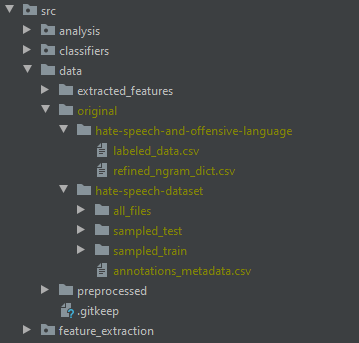

# HateSpeechDetection

Goal of this project is to classify social media posts on hate speech using text analytics methods. Therefore two
datasets were chosen:

- [Automated Hate Speech Detection and the Problem of Offensive Language](https://github.com/t-davidson/hate-speech-and-offensive-language)
- [Hate speech dataset from a white supremacist forum](https://github.com/Vicomtech/hate-speech-dataset)

For more detailed information about the project, please refer to the [project proposal](https://github.com/fidsusj/HateSpeechDetection/blob/main/docs/proposal/project-proposal.pdf)

## Setup Instructions

1. Install pipenv

       pip install pipenv
        
2. Install all the dependencies defined in the Pipfile        
        
       pipenv install --dev
       
3. Install additional dependencies (optional):
        
   - [pdftotext](https://pypi.org/project/pdftotext/) (additional os dependencies needed) (Assignment 1)
        
   - python -m spacy download en (Assignment 2)
        
4. Enter the virtual environment of pipenv

       pipenv shell

5. Set up the git hook scripts
       
       pre-commit install
       
6. Download and add the original datasets

    

7. Run the program

       pipenv run main
       
8. Run the tests

       pipenv run test && pipenv run report
       
9. Leave the virtual environment of pipenv

       exit

## Datasets and papers

### Interesting papers for our purpose
- [Hate Speech on Twitter: A Pragmatic Approach to Collect Hateful and Offensive Expressions and Perform Hate Speech Detection](https://ieeexplore.ieee.org/document/8292838)
- [Evaluating Machine Learning Techniques for Detecting Offensive and Hate Speech in South African Tweets](https://ieeexplore.ieee.org/document/8963960)
- [A Survey on Automatic Detection of Hate Speech in Text](https://dl.acm.org/doi/pdf/10.1145/3232676)
- [Detecting Hate Speech and Offensive Language on Twitter using Machine Learning: An N-gram and TFIDF based Approach](https://arxiv.org/pdf/1809.08651.pdf)
- [Detecting Hate Speech in Social Media](https://arxiv.org/pdf/1712.06427.pdf)
- [Automated Hate Speech Detection and the Problem of Offensive Language∗](https://arxiv.org/pdf/1703.04009.pdf)

### hatespeechdata.com

- [Hate Speech Dataset from a White Supremacy Forum](https://arxiv.org/pdf/1703.04009.pdf)
- [Hateful Symbols or Hateful People? Predictive Features for Hate Speech Detection on Twitter](https://www.aclweb.org/anthology/N16-2013.pdf)
- [A Benchmark Dataset for Learning to Intervene in Online Hate Speech](https://arxiv.org/pdf/1909.04251.pdf)
- [Hate Speech and Offensive Content Identification (HASOC)](https://dl.acm.org/doi/pdf/10.1145/3368567.3368584)
- [Large Scale Crowdsourcing and Characterization of Twitter Abusive Behavior](https://arxiv.org/pdf/1802.00393.pdf)
- [Cyberbullying Datasets (WoW Forum and LoL Forum)](https://aisel.aisnet.org/cgi/viewcontent.cgi?article=1061&context=ecis2016_rp)
- [Detecting Online Hate Speech Using Context Aware Models](https://arxiv.org/pdf/1710.07395.pdf)
- [Automated Hate Speech Detection and the Problem of Offensive Language∗](https://arxiv.org/pdf/1703.04009.pdf)
    
### ACM (VPN required)

- [Deep Learning for Hate Speech Detection in Tweets](https://dl.acm.org/doi/pdf/10.1145/3041021.3054223)
- [Towards Automatic Detection and Explanation of Hate Speech and Offensive Language](https://dl.acm.org/doi/pdf/10.1145/3375708.3380312)
- [Detecting Hate, Offensive, and Regular Speech in Short Comments](https://dl.acm.org/doi/pdf/10.1145/3126858.3131576)
- [Mean Birds: Detecting Aggression and Bullying on Twitter](https://dl.acm.org/doi/pdf/10.1145/3091478.3091487)
- [A Unified Deep Learning Architecture for Abuse Detection](https://dl.acm.org/doi/pdf/10.1145/3292522.3326028)
- [Identifying Hate Speech in Social Media](https://dl.acm.org/doi/pdf/10.1145/3155212)
- [A Survey on Automatic Detection of Hate Speech in Text](https://dl.acm.org/doi/pdf/10.1145/3232676)

### IEEE (VPN required for $$$ marked papers)

- [Hate Speech Detection on Twitter Using Long Short-Term Memory (LSTM) Method](https://ieeexplore.ieee.org/document/9003992) [$$$]
- [Automated Hate Speech Detection on Twitter](https://ieeexplore.ieee.org/document/9128428) [$$$]
- [Hate Speech on Twitter: A Pragmatic Approach to Collect Hateful and Offensive Expressions and Perform Hate Speech Detection](https://ieeexplore.ieee.org/document/8292838)
- [Hate Speech Detection on Twitter Using Multinomial Logistic Regression Classification Method](https://ieeexplore.ieee.org/document/8980379) [$$$]
- [A Framework for Hate Speech Detection using Deep Convolutional Neural Network](https://ieeexplore.ieee.org/document/9253658)
- [Text Analysis For Hate Speech Detection Using Backpropagation Neural Network](https://ieeexplore.ieee.org/document/8712109)
- [Analysis Text of Hate Speech Detection Using Recurrent Neural Network](https://ieeexplore.ieee.org/document/8712104)
- [Hate Speech Detection using Global Vector and Deep Belief Network Algorithm](https://ieeexplore.ieee.org/document/9245467)
- [Evaluating Machine Learning Techniques for Detecting Offensive and Hate Speech in South African Tweets](https://ieeexplore.ieee.org/document/8963960)

### Arxiv

- [Detecting White Supremacist Hate Speech using Domain Specific Word Embedding with Deep Learning and BERT](https://arxiv.org/pdf/2010.00357.pdf)
- [ETHOS: an Online Hate Speech Detection Dataset](https://arxiv.org/pdf/2006.08328.pdf)
- [Investigating Deep Learning Approaches for Hate Speech Detection in Social Media ](https://arxiv.org/ftp/arxiv/papers/2005/2005.14690.pdf)
- [A BERT-Based Transfer Learning Approach for Hate Speech Detection in Online Social Media](https://arxiv.org/pdf/1910.12574.pdf)
- [Transfer Learning for Hate Speech Detection in Social Media](https://arxiv.org/pdf/1906.03829.pdf)
- [Detecting Hate Speech and Offensive Language on Twitter using Machine Learning: An N-gram and TFIDF based Approach](https://arxiv.org/pdf/1809.08651.pdf)
- [Hate Speech Detection: A Solved Problem? The Challenging Case of Long Tail on Twitter](https://arxiv.org/pdf/1803.03662.pdf)
- [Detecting Hate Speech in Social Media](https://arxiv.org/pdf/1712.06427.pdf)
