# Milestone - HateSpeechDetection

- Christopher Klammt (iv249@stud.uni-heidelberg.de)
- Felix Hausberger (eb260@stud.uni-heidelberg.de)
- Nils Krehl (pu268@stud.uni-heidelberg.de)

## Project State

### Planning State

Following tasks are already finished:
* Clarification of the project idea
* Finding datasets
* First version of a preprocessing pipeline
* Get to know the dataset
* Statistics on the prepared dataset

Started, but not yet finished tasks:
* Feature extraction

### Future Planning

The following table illustrates the future planning of the project with milestones and the corresponding dates:

| Date         | Milestone                                        |
|--------------|--------------------------------------------------|
| early january| Feature extraction and data preparation finished |
| early january| Handling of unbalanced dataset clarified         |
| mid january  | Different classifiers selected                   |
| mid january  | Start classification experiments                 |
| mid february | Project coding finished                          |
| 25.02.2021   | Project video deadline                           |
| 15.03.2021   | Report deadline                                  |

### High-level Architecture Description

The High-Level architecture of our preprocessing pipeline is already described in the next chapter "Data Analysis". This chapter focuses on the High-Level architecture of the whole project.
Mainly there are four steps:
* **Preprocessing**: The groundtruth datasets are prepared for our purposes.
* **Feature extraction**: Based on the preprocessed dataset different features are extracted (e.g. number of rather positive or negative words).
* **Classification**: Experiments with different combination of  classifiers and features.
* **Evaluation and comparison**: Results of the previous step are evaluated.

### Experiments (baselines)

One recommendation in the project kickoff meeting was to focus on the first two steps (Preprocessing and feature extraction). That is why first experiments are done in these two areas. The experiments for exploring the dataset are described in the next chapter.

## Data Analysis

### Data Sources

As mentioned in the project proposal we are using two data sets for this project:
- [Automated Hate Speech Detection and the Problem of Offensive Language](https://github.com/t-davidson/hate-speech-and-offensive-language) uses data from the Twitter API and classifies the round about 25k tweets as hate speech, offensive language or neutral (ternary classification style)
- [Hate speech dataset from a white supremacist forum](https://github.com/Vicomtech/hate-speech-dataset) consists of data extracted from the White Supremacy Forum and classifies the sentences in a binary fashion as hate or no hate

### Preprocessing

Due to the differences in the data sets - mainly one being binary labeled and the other being ternary labeled - the two data sets first have to be unified and merged into one data set.
To do so, the function `prepare_and_merge_datasets()` calls the specific function for the separate data sets.
The data from the Twitter API is preprocessed, such that all documents containing offensive language are dropped, as for now we want to concentrate on classifying hate speech.
Both data sets are merged into one while standardizing them, so that all sentences containing hate speech are labeled with a `0` and the neutral samples are labeled with a `1`.

After merging the two data sets, the actual preprocessing can start (executed in the `build_corpus` function in the `corpus.py` file).
First of all the sentences are converted to lower case and all none-word characters are removed.
In the second step, the sentences are tokenized, such that every datapoint consists of a list of tokens (=words).
Furthermore, the tokens are cleaned, meaning that single characters, i.e. all tokens shorter than 3 characters are omitted.
Based on these cleaned tokens, stemming is conducted. This simplifies the phrases by removing endings (as discussed in the course).

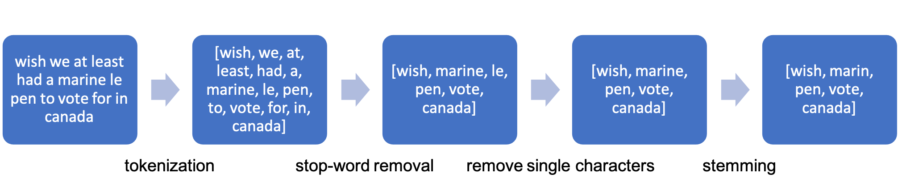

In the image above this pipeline is illustrated by means of an example sentence.

### Basic Statistics

The following image shows the distribution of the data points.

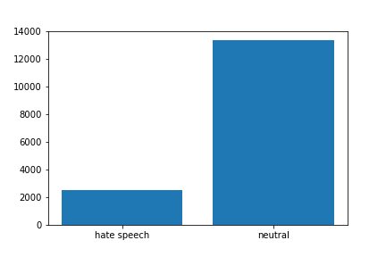

As one can see, there are more sentences in the combined data set marked as neutral than labeled as containing hate speech.
There are 13,335 neutral sentences and 2,490 hate speech examples in our merged data set.
This therefore is an imbalanced dataset which can lead to a decrease in performance and accuracy with machine learning classification. As a comparison the paper ["Evaluating Machine Learning Techniques for Detecting Offensive and Hate Speech in South African Tweets"](https://ieeexplore.ieee.org/document/8963960) also recognizes the class imbalance and tried to reduce it by applying a synthetic minority oversampling technique called SMOTE (as presented [here](https://arxiv.org/pdf/1106.1813.pdf)).
There are also some other approaches to tackle this challenge:

- changing performance metric (don't simply use accuracy, better something like F1-score)
- resampling the dataset (undersampling, i.e. deleting instances form the over-represented class, or oversampling, i.e. adding copies of instances from the under-represented class)
- generating synthetic samples

In general it is important to consider class imbalance and play with the different possibilities to eliminate the effect it has on performance.

Another interesting perspective on the data is won by looking at the length of hate speech posts versus non-hate speech posts.
This can be seen in the following visualization:

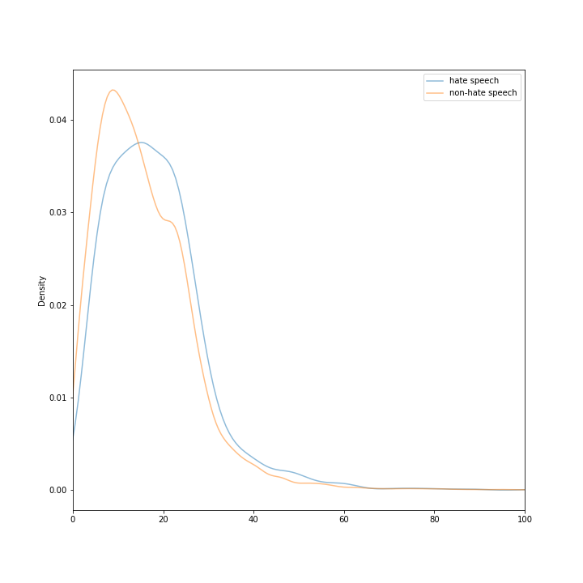

Here one can see, that the hate speech posts contain more words (tokens before cleaning) than non-hate speech posts.
In average a hate speech post contains 18.18 words, whereas a non-hate speech post only contains 15.85 words.
Unlike expected, the hate speech posts are longer than the non-hate speech posts.
But as one can see in the following boxplots, the hate speech posts have only one big outlier at 350 words and otherwise usually contain less than 50 words with only a few outliers between 50 and 100 words per post.
On the other hand the non-hate speech posts also consists of outliers between 50 and 150 words (plus three extreme outliers above that). But in general also only consist of 50 words and less.

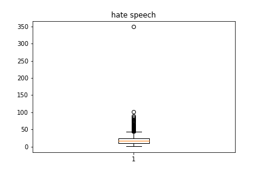
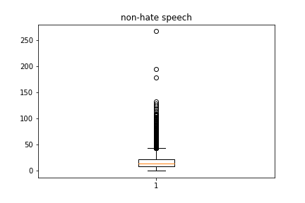

This can also be seen in the respective histograms:

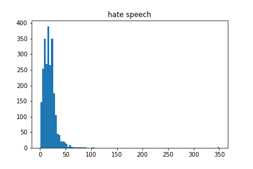
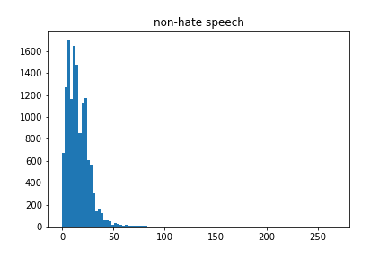

In the following the words that occur the most in the respective classes are analyzed.

As a comparison one can see the bar charts of the 15 most common tokens for hate speech vs. non-hate speech.
These do not really differ, because most of the words are stop words which are to be removed in the processing pipeline.

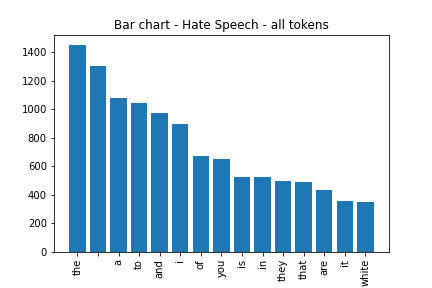
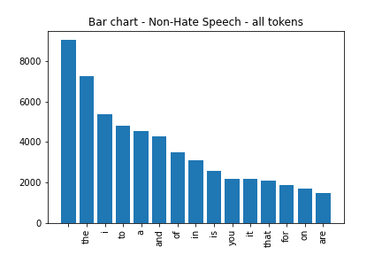

The differences in hate speech and non-hate speech get more clear, when looking at the cleaned tokens.
This is illustrated in the following wordclouds, which are based on the 15 most common cleaned tokens for each class respectively.

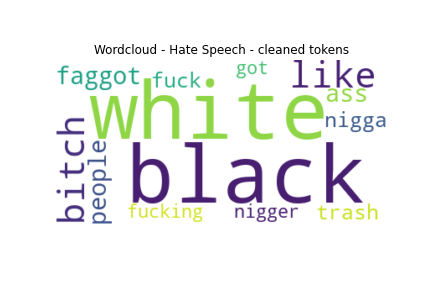
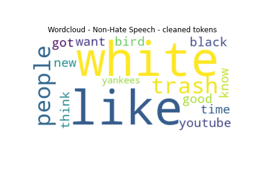

The word clouds are based on the following bar chart distributions:

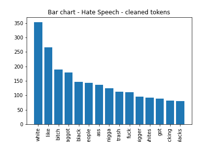
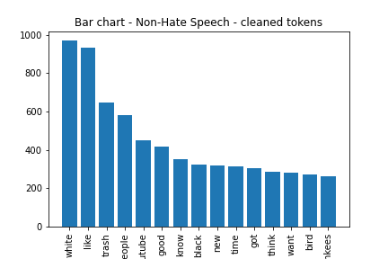

See the folder `figures` for more illustration or the jupyter notebook `data_visualization.ipynb` for the complete code.

### Examples

For a better insight into the data set, a few examples are shown in the following.

Examples for non-hate speech:
- "billy that guy would nt leave me alone so i gave him the trudeau salute"
- "this is after a famous incident of former prime minister pierre trudeau who gave the finger to a group of protesters who were yelling antifrench sayings at him"
- "askdems arent you embarrassed that charlie rangel remains in your caucus"

These are neutral sentences, including a rather incomprehensible example (the last sentence).

Examples for hate speech:
- "california is full of white trash"
- "and yes they will steal anything from whites because they think whites owe them something so it s ok to steal"
- "why white people used to say that sex was a sin used to be a mystery to me until i saw the children of browns and mixed race children popping up all around me"

One can clearly see the hate expressed in the hate speech examples and see their discriminating nature.
