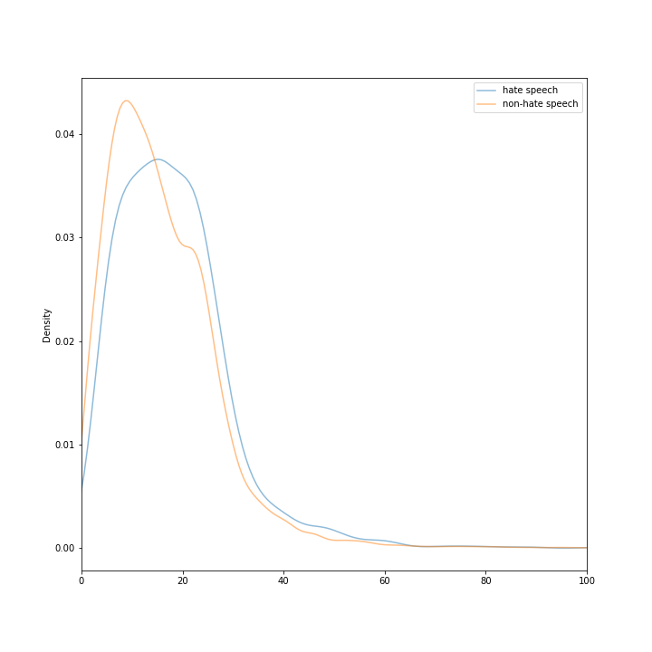

# Milestone - HateSpeechDetection

- Christopher Klammt (iv249@stud.uni-heidelberg.de)
- Felix Hausberger (eb260@stud.uni-heidelberg.de)
- Nils Krehl (pu268@stud.uni-heidelberg.de)

## Project State

### Current State

Following tasks are already finished:
* Clarification of the project idea
* Finding datasets
* Bulding the preprocessing pipeline and a common corpus
* Statistics on the prepared dataset

Started, but not yet finished tasks:
* Feature extraction

### Future Planning

The following table illustrates the future planning of the project with milestones and the corresponding dates:

| Date         | Milestone                         |
|--------------|-----------------------------------|
| early january| Feature extraction       finished |
| mid january  | Different classifiers selected    |
| mid january  | Start classification experiments  |
| mid february | Project coding finished           |
| 25.02.2021   | Project video deadline            |
| 15.03.2021   | Report deadline                   |

## Dataset Preparation

To prepare a central dataset, both single datasets had to be transformed into a common format. For the central dataset 
only the class and the text content of each tweet respectively each forum contribution was considered. 

The first dataset "Automated Hate Speech Detection and the Problem of Offensive Language" was entirely given as a .csv 
file and contains 25297 tweets, that were either labeled as hate speech, offensive language or neither of both. To 
determine the right label three independent evaluators classified each tweet, the final label got assigned by the 
majority vote. As for the first approach one is only interested in hate speech and neutral tweet classification, all 
offensive language documents in the dataset were dropped. Some tweets were retweets that were commented additionally by 
a user. As it could not be distinguished whether the original tweet or the retweet contains hate speech also these 
documents were filtered out. An example is shown below:

    """@jaimescudi_: ""@Tonybthrz_: ""@jaimescudi_: I swear if oomf try talking to me tomorrow.."" @"" @BarackObama"" pussy"

The original tweets can be found in between the ""..."". Same goes for tweets that cite other users without using the 
retweet option. 

The second dataset "Hate speech dataset from a white supremacist forum" was not entirely given as a .csv file. Only the 
document annotations were given in a .csv file, all forum contributions were stored in separated .txt files. Only 
documents which could not be assigned to a single class (label "idk/skip") or refered to other docments (label 
"relation") were dropped. 

The resulting common dataset was stored in a .csv file. It contains 2.491 hate speech documents and 13.336 non hate 
speech documents. The dropped offensive language documents make up 17.505 instances. In case the classification results 
are too poor, additional 2.818 offensive language documents can be added that were labeled as hate speech by one evaluator. 

To sample a balanced dataset, all hate speech documents can be chosen, while non hate speech documents could be randomly 
picked and added to the same amount to the sample. For other, better techniques to reach a balanced dataset, see the 
_Data Analysis_ chapter. The train and test split will be done keeping the same class distribution over both train and 
test set with a 2:1 ratio. 

## Corpus Building

The common dataset is loaded from the .csv file into a pandas dataframe. After doing basic preprocessing like removing
emojis and other irrelevant characters, spacy is used to build a tokenized corpus. The language model that spacy brings 
decides about stop word, punctuation and white space removal. No hard coded logic or stop word lists are used in this 
process. This keeps URLs or other tokens including punctuation as one token. Furthermore no stemming was applied to the 
tokens, instead lemmatization was used as one can in this case lateron use pretrained word embeddings from i.e. Word2Vec. 
Furthernore tokenization works better using the lemmas instead of word stems (e.g. We'll becomes ["we","will"] and not 
["we", "'ll"]. Some examples are covered in the test written for the corpus building process.

## Data Analysis - Basic Statistics

The following image shows the distribution of the data points.

As one can see, there are more sentences in the combined data set marked as neutral than labeled as containing hate 
speech. There are 13.336 neutral sentences and 2.491 hate speech examples in our merged data set. This therefore is an 
imbalanced dataset which can lead to a decrease in performance and accuracy with machine learning classification. As a 
comparison the paper ["Evaluating Machine Learning Techniques for Detecting Offensive and Hate Speech in South African Tweets"](https://ieeexplore.ieee.org/document/8963960) 
also recognizes the class imbalance and tried to reduce it by applying a synthetic minority oversampling technique 
called SMOTE (as presented [here](https://arxiv.org/pdf/1106.1813.pdf)). There are also some other approaches to tackle 
this challenge:

- changing performance metric (don't simply use accuracy, better something like F1-score)
- resampling the dataset (undersampling, i.e. deleting instances form the over-represented class, or oversampling, i.e. 
adding copies of instances from the under-represented class)
- generating synthetic samples

In general it is important to consider class imbalance and play with the different possibilities to eliminate the effect 
it has on performance.

Another interesting perspective on the data is won by looking at the length of hate speech posts versus non-hate speech 
posts. This can be seen in the following visualization:

Here one can see, that the hate speech posts contain more words (tokens before cleaning) than non-hate speech posts.
In average a hate speech post contains 18.18 words, whereas a non-hate speech post only contains 15.85 words.
Unlike expected, the hate speech posts are longer than the non-hate speech posts. But as one can see in the following 
boxplots, the hate speech posts have only one big outlier at 350 words and otherwise usually contain less than 50 words 
with only a few outliers between 50 and 100 words per post. On the other hand the non-hate speech posts also consists of 
outliers between 50 and 150 words (plus three extreme outliers above that). But in general also only consist of 50 words 
and less.

This can also be seen in the respective histograms:

In the following the words that occur the most in the respective classes are analyzed.

As a comparison one can see the bar charts of the 15 most common tokens for hate speech vs. non-hate speech. These do not 
really differ, because most of the words are stop words which are to be removed in the processing pipeline.

The differences in hate speech and non-hate speech get more clear, when looking at the cleaned tokens. This is illustrated 
in the following wordclouds, which are based on the 15 most common cleaned tokens for each class respectively.

The word clouds are based on the following bar chart distributions:

See the folder `figures` for more illustration or the jupyter notebook `data_visualization.ipynb` for the complete code.

### Examples

For a better insight into the data set, a few examples are shown in the following.

Examples for non-hate speech:
- "billy that guy would nt leave me alone so i gave him the trudeau salute"
- "this is after a famous incident of former prime minister pierre trudeau who gave the finger to a group of protesters 
who were yelling antifrench sayings at him"
- "askdems arent you embarrassed that charlie rangel remains in your caucus"

These are neutral sentences, including a rather incomprehensible example (the last sentence).

Examples for hate speech:
- "california is full of white trash"
- "and yes they will steal anything from whites because they think whites owe them something so it s ok to steal"
- "why white people used to say that sex was a sin used to be a mystery to me until i saw the children of browns and 
mixed race children popping up all around me"

One can clearly see the hate expressed in the hate speech examples and see their discriminating nature.

## Feature extraction

### Semantic features

#### Special characters

Semantic features could be the number of special characters such as "!" per data instance. Our feature_extraction module 
provides the possibility to count the number of any choosen character. In the current state the number of "!", "?" and 
"." per data instance is determined. The code is developed with the open closed pattern in mind, so it is easily 
possible to add more special characters to the feature extraction.

#### Topic Detection

Another way to receive information of possible hate speech in a document is by detecting its topic. This can be done using
singular value decomposition, non-negative matrix factorization or probabilisic latent semantic analysis. This field of 
analysis it still to be addressed until early january.

### Sentiment features

As already stated above the process of feature extraction is not finished yet. Currently no sentiment features are 
extracted. Sentiment feature extraction is going to be done until early january. Potential features are the number of 
rather positive/negative words and the number of slang words.

### Ngram features

#### TF-IDF
The TF-IDF is determined on two documents. One containing all hate speech data instances and another document containing 
all neutral data instances. The TF-IDF analysis delivers the typical hate speech and neutral words. The following heatmap 
shows the results:

#### Dictionary
Based on the TF-IDF results a dictionary of typical hate speech and neutral words is built. Therefore the TF-IDF matrix 
is sorted foreach document (hate speech, neutral) in descending order and the top n items are selected. In the next step 
ensures, that both lists are distinct. If a word occurs in both lists it is deleted from both lists.

As a feature the number of hate speech words and the number of neutral words is counted per data instance.

### Pattern features

#### Word Embeddings using Word2Vec

During the training process of the Word2Vec model, the following hyperparameters were chosen:

- Tokens with a frequency less than 20 were discarded
- Window size is set to two in both directions
- Word vectors contain a dimensionality of 300
- Learning rate is set to 0.03 and decreases until 0.0007

Note that these values are first experimental values and have not been evaluated yet. 
The model was saves as a pickle file to avoid retraining in the following steps. 

## Classifier Design Thinking

## Current Code State

### Project Architecture Description

The project uses pipenv to maintain almost all project dependencies (using a Pipfile). For project setup instructions 
please refer to the central README. The project stucture is shown below.  

        +-- .github
        |   +-- workflows
        |   |   +-- code_quality.yml
        |   |   +-- test.yml
        +-- assignments
        |   +-- 1
        |   +-- 2
        |   +-- ...
        +-- docs
        |   +-- milestone
        |   +-- proposal
        |   +-- ...
        +-- htmlcov
        +-- src
        |   +-- analysis
        |   +-- classifier
        |   +-- data
        |   +-- feature_extraction
        |   +-- preprocessing
        |   +-- main.py
        +-- tests
        |   +-- feature_extraction
        |   +-- preprocessing
        |   +-- ...
        +-- index.html

GitHub actions are used to run the logical and stylistic linter _PyLint_, the code formatter _Black_, the python 
import sorter _Isort_ and the python _Unittest_ tests on every push or pull request. Each action runs on the latest 
version of windows, macOS and ubuntu. The GitHub action are defined in the _.github_ folder. More detailed information 
follows in the next chapter. 

All assignments can be found in the _assignments_ folder, all submitted documents in the _docs_ folder, test coverage 
reports in the _htmlcov_ folder. To inspect a coverage report open the _index.html_ file. 

The _src_ and _tests_ folder are both recursively designed as python modules. This enables cross-module imports and 
common _PyLint_ configuration on the project root level. In _src/analysis_ basic statistics about the used dataset and 
extracted feature representations can be found in a jupyter notebook. All developed classifiers will be gathered in 
_src/classifiers_ and evaluated in _src/evaluation_ in a later state of the project. The _data_ folder contains the 
preprocessed common dataset. The original datasets need to be added manually according to the setup instructions. Coding 
about word representations can be found in _src/feature_extraction_ whereas coding about buildung a central dataset and 
corpus is located in _src/preprocessing_. Trained models are stored in _src/models_. 

The _tests_ folder contains the unit tests for the project. Its structure equals to the _src_ folder. 

### Code Quality

To guarantee proper code quality, we use the _PyLint_ as a logical and stylistic linter. It makes sure, that variables 
are written in snake case, docstrings are added for every module, class or function, and detects unused imports. For a 
complete list of message codes from _PyLint_ please refer to the [documentation](https://docs.pylint.org/en/1.6.0/features.html).
_PyLint_ can be integrated as an external plugin to almost every IDE. 

_Black_ is a code formatter that keeps the format of code throughout the project consistent. It can be added as an external 
programm to the IDE. One has to apply _Black_ using a keycode combination. 

_Isort_ is the last dependency used to sort imports alphabetically, and automatically separated into sections and by type. 
It provides a command line utility, python library and plugins for various editors. 

All these checks are automatically applied when trying to commit and push changes to GitHub. We use the _pre-commit_ 
module to add git hooks that automatically run these checks on every commit. After the changes were pushed to GitHub,
an additional GitHub action is triggered that once again runs these code quality tools. The action is defined in 
_.github/workflows/code_quality.yml_.

Exluding _PyLint_ codes can be done in the central _.pylintrc_ file, configuration for the _Isort_ library is done the 
_.isort.cfg_ file. 

### Tests

Tests were written for ngram and semantic feature extractions as well as for some key concepts behind the corpus 
building. On every GitHub push or pull request an action defined in _.github/workflows/test.yml_ is trigged and all
tests get executed on the latest windows, macOS and ubuntu version.
